# SauceDemo Exploratory Bug Report

## Exploratory Testing Strategy

I used a combination of a user-journey tour and an error/state-transition tour, focusing on the main purchase flow from login through order confirmation. I also explored input validation, empty and abnormal states, and application behavior under different provided user accounts to identify functional, validation, performance, data-consistency, and UI issues.

## BUG-001 — Checkout accepts whitespace-only values in required customer information fields

**Environment:**
- Browser: Google Chrome 151.0.7922.76
- OS: Windows 11 Pro
- Viewport: 1920x1080

**Steps to Reproduce:**
1. Log in as `standard_user`.
2. Add any product to the cart.
3. Open the cart and click **Checkout**.
4. Enter valid values in two of the required fields.
5. Enter spaces only in the remaining required field.
6. Click **Continue**.
7. Repeat the check for **First Name**, **Last Name**, and **Postal Code**.

**Expected Result:**  
Whitespace-only values should be treated as empty input. The user should remain on the **Checkout: Your Information** page and see the corresponding required-field validation error.

**Actual Result:**  
Whitespace-only values are accepted as valid input. The user is allowed to proceed to the **Checkout Overview** page regardless of which required field contains only spaces.

**Severity:** Major — required checkout validation can be bypassed and invalid customer information can enter the order flow.

**Priority:** P1 — the issue affects required-field validation in the core checkout flow and should be fixed before release.

**Attachments:**

Before clicking Continue:

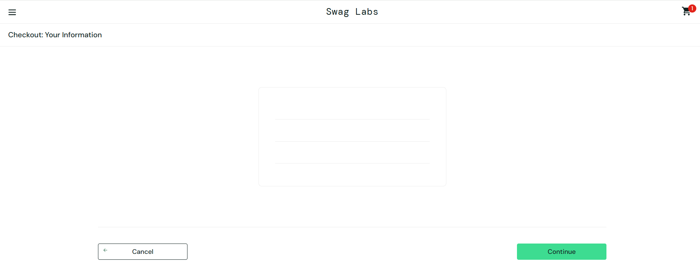

After clicking Continue:

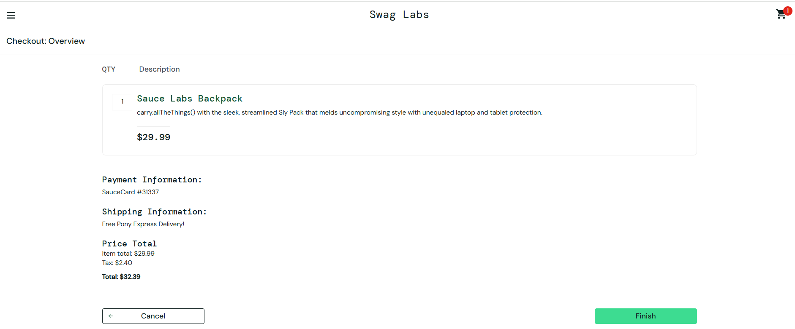

---

## BUG-002 — User can complete checkout with an empty cart

**Environment:**
- Browser: Google Chrome 151.0.7922.76
- OS: Windows 11 Pro
- Viewport: 1920x1080

**Steps to Reproduce:**
1. Log in as `standard_user`.
2. Open the cart without adding any products.
3. Click **Checkout**.
4. Enter valid First Name, Last Name, and Postal Code.
5. Click **Continue**.
6. Click **Finish**.

**Expected Result:**  
Based on typical e-commerce behavior, an order should contain at least one product. The application should prevent checkout completion when the cart is empty.

**Actual Result:**  
The user can proceed through the checkout flow with an empty cart and successfully reach the order confirmation page. The order total is `$0.00`.

**Severity:** Major — the application allows an invalid empty order to pass through the complete checkout flow.

**Priority:** P2 — the issue affects core checkout logic, but the expected behavior is based on a business assumption because no formal requirement for empty-cart checkout was provided.

**Attachments:**

Empty cart before checkout:

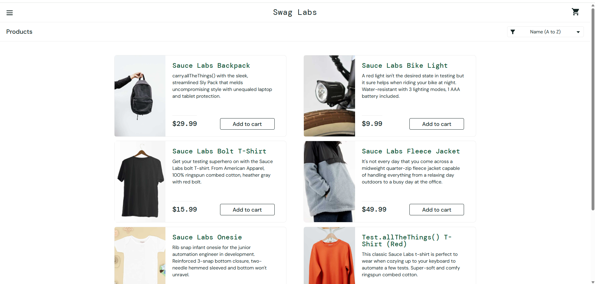

Checkout Overview with zero-value order:

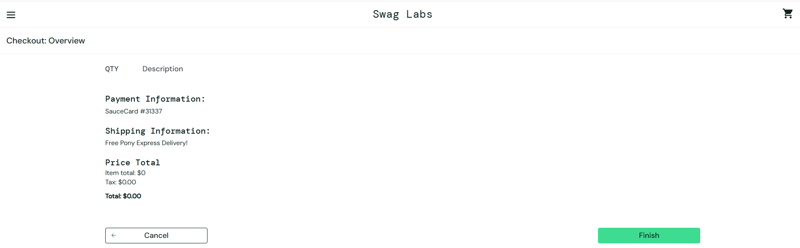

Order confirmation after completing empty checkout:

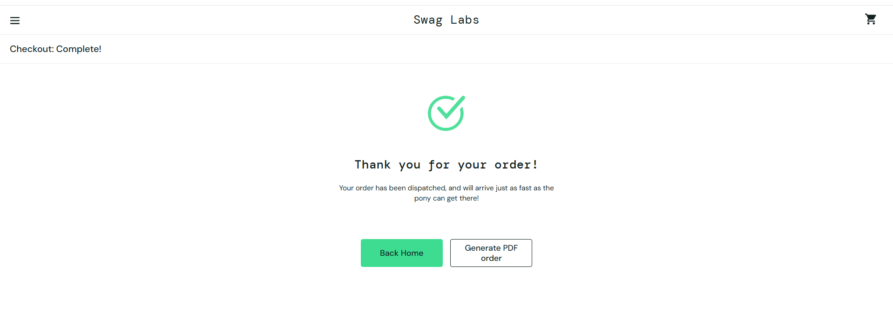

---

## BUG-003 — Typing in Last Name field overwrites First Name for `problem_user`

**Environment:**
- Browser: Google Chrome 151.0.7922.76
- OS: Windows 11 Pro
- Viewport: 1920x1080

**Steps to Reproduce:**
1. Log in as `problem_user`.
2. Add any product to the cart.
3. Open the cart and click **Checkout**.
4. On the **Checkout: Your Information** page, enter a valid value in the **First Name** field, for example `John`.
5. Click the **Last Name** field.
6. Type a value, for example `Smith`.

**Expected Result:**  
The entered text should appear in the **Last Name** field, while the **First Name** field should remain unchanged.

**Actual Result:**  
The **Last Name** field remains empty. When the first character is typed into the **Last Name** field, the existing value in **First Name** is cleared and replaced with that character. Each subsequent character typed into **Last Name** replaces the value in **First Name** with the latest entered character.

**Severity:** Major — the user cannot correctly provide required checkout information, which blocks normal checkout behavior.

**Priority:** P1 — the defect affects the core checkout flow for a provided application user and should be fixed before release.

**Attachment:**

[Screen recording](attachments/BUG-003-last-name-overwrites-first-name.mp4)

---

## BUG-004 — Incorrect product images are displayed for `problem_user`

**Environment:**
- Browser: Google Chrome 151.0.7922.76
- OS: Windows 11 Pro
- Viewport: 1920x1080

**Steps to Reproduce:**
1. Log in as `problem_user`.
2. Open the **Products** page.
3. Observe the product images displayed for different items in the inventory.

**Expected Result:**  
Each product should display an image that corresponds to that specific product.

**Actual Result:**  
Multiple different products display the same dog image instead of their corresponding product images.

**Severity:** Minor — the issue does not block purchasing functionality, but product content is displayed incorrectly and may confuse the user.

**Priority:** P2 — the defect is clearly visible in the main product catalog, but it does not prevent the user from completing the core purchase flow.

**Attachment:**

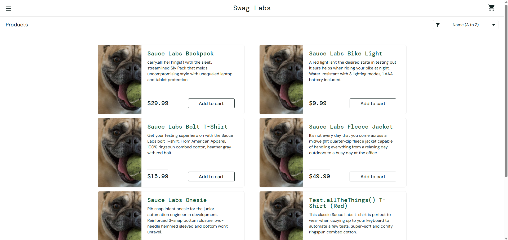

---

## BUG-005 — Multiple actions have excessive response delays for `performance_glitch_user`

**Environment:**
- Browser: Google Chrome 151.0.7922.76
- OS: Windows 11 Pro
- Viewport: 1920x1080

**Steps to Reproduce:**
1. Log in as `performance_glitch_user`.
2. Observe the time between clicking **Login** and displaying the **Products** page.
3. On the **Products** page, change the product sorting option.
4. Complete a purchase through the checkout flow.
5. On the order confirmation page, click **Back Home**.
6. Observe the response time for each action.

**Expected Result:**  
User actions should be processed within a reasonable response time without excessive delays.

**Actual Result:**  
Multiple unrelated actions consistently experience significant response delays:
- Login and navigation to the **Products** page takes approximately 15 seconds.
- Changing the product sorting option causes a noticeable delay before the product list is updated.
- Clicking **Back Home** after completing an order causes a noticeable delay before returning to the **Products** page.

**Severity:** Minor — the affected functionality eventually completes successfully, but the excessive delays significantly degrade the user experience.

**Priority:** P2 — the issue affects multiple frequently used actions and should be investigated, although it does not currently block the purchase flow.

**Attachment:**

[Screen recording](attachments/BUG-005-performance-delays.mp4)

---

## BUG-006 — Product sorting options are not applied for `problem_user`

**Environment:**
- Browser: Google Chrome 151.0.7922.76
- OS: Windows 11 Pro
- Viewport: 1920x1080

**Steps to Reproduce:**
1. Log in as `problem_user`.
2. Open the **Products** page.
3. Open the sorting dropdown.
4. Select any sorting option, for example **Price (low to high)**.
5. Observe the product list.
6. Repeat the check with another option, for example **Name (Z to A)**.

**Expected Result:**  
The selected sorting option should be applied and the product list should be reordered accordingly.

**Actual Result:**  
The sorting dropdown opens normally, but selecting any sorting option has no effect. The selected option is not applied and the product order remains unchanged.

**Severity:** Minor — product browsing remains possible, but the sorting functionality is not working.

**Priority:** P2 — the defect affects a visible catalog feature, although it does not block the core purchase flow.

**Attachment:**

[Screen recording](attachments/BUG-006-sorting-not-applied.mp4)

---

## BUG-007 — Sorting triggers an error alert for `error_user`

**Environment:**
- Browser: Google Chrome 151.0.7922.76
- OS: Windows 11 Pro
- Viewport: 1920x1080

**Steps to Reproduce:**
1. Log in as `error_user`.
2. Open the **Products** page.
3. Open the sorting dropdown.
4. Select any sorting option.

**Expected Result:**  
The selected sorting option should be applied and the product list should be reordered without errors.

**Actual Result:**  
An error alert is displayed after selecting a sorting option:

`Sorting is broken! This error has been reported to Backtrace.`

The sorting operation is not completed.

**Severity:** Minor — product browsing remains available, but the sorting functionality fails and exposes an internal error message to the user.

**Priority:** P2 — the defect affects a visible catalog feature, although it does not block the core purchase flow.

**Attachments:**

Logged in as `error_user`:

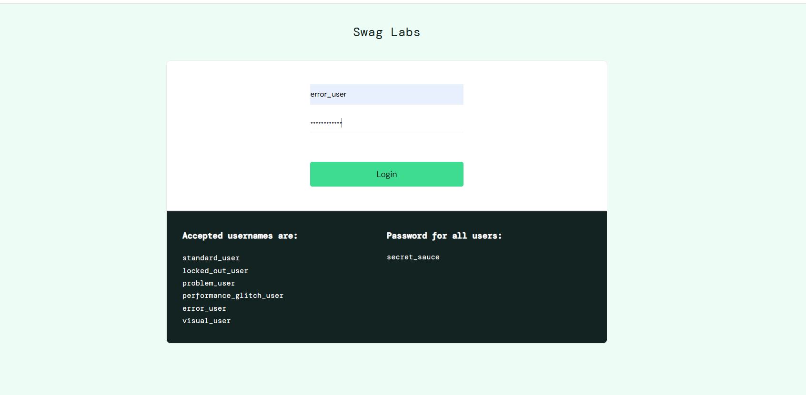

Sorting error alert:

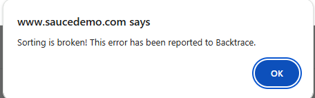

---

## BUG-008 — Remove button on Products page does not remove item from cart for `problem_user` and `error_user`

**Environment:**
- Browser: Google Chrome 151.0.7922.76
- OS: Windows 11 Pro
- Viewport: 1920x1080

**Affected users:**
- `problem_user`
- `error_user`

**Steps to Reproduce:**
1. Log in as `problem_user` or `error_user`.
2. Add any product to the cart from the **Products** page.
3. Click **Remove** for the same product directly on the **Products** page.

**Expected Result:**  
The product should be removed from the cart, the button should change back to **Add to cart**, and the cart badge should be updated.

**Actual Result:**  
Clicking **Remove** on the **Products** page has no effect. The product remains in the cart, the **Remove** button remains visible, and the cart badge is not updated. The product can still be removed successfully from the **Cart** page.

**Severity:** Major — a core cart operation does not work from the main product catalog, although a workaround exists through the Cart page.

**Priority:** P2 — the issue affects a frequently used cart action but does not completely block product removal.

**Attachment:**

[Screen recording](attachments/BUG-008-inventory-remove-not-working.mp4)

---

## BUG-009 — Last Name field cannot be filled but checkout proceeds for `error_user`

**Environment:**
- Browser: Google Chrome 151.0.7922.76
- OS: Windows 11 Pro
- Viewport: 1920x1080

**Steps to Reproduce:**
1. Log in as `error_user`.
2. Add any product to the cart.
3. Open the cart and click **Checkout**.
4. Enter a valid value in the **First Name** field.
5. Attempt to enter a value in the **Last Name** field.
6. Enter a valid **Postal Code**.
7. Click **Continue**.

**Expected Result:**  
The **Last Name** field should accept user input. If the required field is empty, the application should prevent the user from proceeding and display a validation error.

**Actual Result:**  
The **Last Name** field does not accept the entered value. Despite the required field remaining empty, the user is allowed to proceed to the **Checkout Overview** page.

**Severity:** Major — required customer information cannot be entered correctly and required-field validation is bypassed.

**Priority:** P1 — the defect affects required checkout data and allows an invalid order state to proceed.

**Attachment:**

[Screen recording](attachments/BUG-009-last-name-validation-error-user.mp4)

---

## BUG-010 — Finish button does not provide any response for `error_user`

**Environment:**
- Browser: Google Chrome 151.0.7922.76
- OS: Windows 11 Pro
- Viewport: 1920x1080

**Steps to Reproduce:**
1. Log in as `error_user`.
2. Add any product to the cart.
3. Proceed through the checkout flow until the **Checkout Overview** page is displayed.
4. Click **Finish**.

**Expected Result:**  
Clicking **Finish** should either complete the order when the checkout state is valid or display a clear validation/error message if the order cannot be completed. The action should not fail silently.

**Actual Result:**  
Clicking **Finish** has no visible effect. The user remains on the **Checkout Overview** page, no validation or error message is displayed, and the order is not completed.

**Severity:** Major — the user cannot complete the purchase and receives no feedback explaining why the action failed.

**Priority:** P1 — the issue affects the final step of the core checkout flow and prevents successful order completion for the affected user.

**Attachment:**

[Screen recording](attachments/BUG-010-finish-button-not-working.mp4)

---

## BUG-011 — Shopping cart icon is incorrectly positioned across pages for `visual_user`

**Environment:**
- Browser: Google Chrome 151.0.7922.76
- OS: Windows 11 Pro
- Viewport: 1920x1080

**Steps to Reproduce:**
1. Log in as `visual_user`.
2. Open the **Products** page.
3. Observe the shopping cart icon in the page header.
4. Navigate to the **Cart** page and other available pages.
5. Observe the shopping cart icon position.

**Expected Result:**  
The shopping cart icon should remain correctly aligned within the header and maintain a consistent position across all application pages.

**Actual Result:**  
The shopping cart icon is incorrectly positioned and shifted from its expected header location. The same layout issue is visible across multiple application pages for `visual_user`.

**Severity:** Minor — the issue does not prevent the user from using the cart, but causes a clearly visible layout defect across the application.

**Priority:** P2 — the defect affects a persistent navigation element on multiple pages, although the core functionality remains available.

**Attachments:**

Shopping cart icon on the Products page:

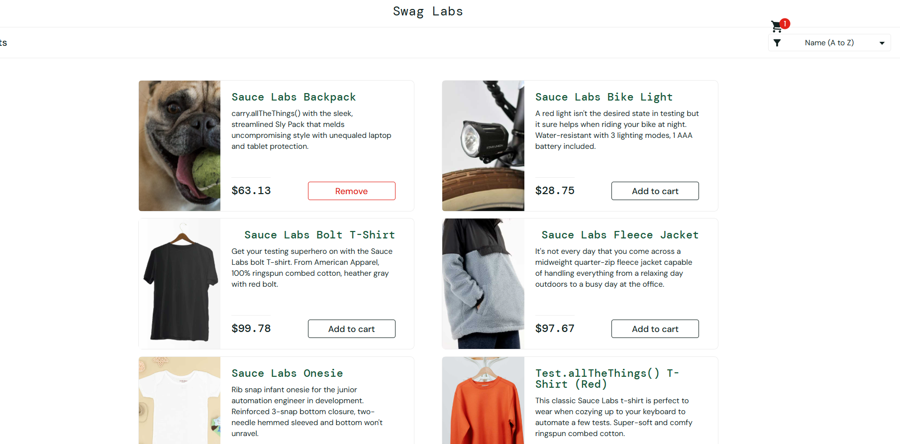

Shopping cart icon on the Cart page:

---

## BUG-012 — Checkout button is incorrectly positioned on Cart page for `visual_user`

**Environment:**
- Browser: Google Chrome 151.0.7922.76
- OS: Windows 11 Pro
- Viewport: 1920x1080

**Steps to Reproduce:**
1. Log in as `visual_user`.
2. Add any product to the cart.
3. Open the **Cart** page.
4. Observe the position of the **Checkout** button.

**Expected Result:**  
The **Checkout** button should be positioned within the cart action area and aligned consistently with the rest of the page layout.

**Actual Result:**  
The **Checkout** button is incorrectly positioned in the upper-right corner of the page, outside its expected location in the cart action area.

**Severity:** Minor — checkout functionality remains available, but the page layout is visibly broken.

**Priority:** P2 — the defect affects the usability and visual consistency of an important checkout action but does not block the purchase flow.

**Attachment:**

## BUG-013 — Product price differs between Products and Cart pages for `visual_user`

**Environment:**
- Browser: Google Chrome 151.0.7922.76
- OS: Windows 11 Pro
- Viewport: 1920x1080

**Steps to Reproduce:**
1. Log in as `visual_user`.
2. On the **Products** page, observe the price of **Sauce Labs Backpack**.
3. Add **Sauce Labs Backpack** to the cart.
4. Open the **Cart** page.
5. Observe the price of the same product.

**Expected Result:**  
The product price should remain consistent across the **Products** and **Cart** pages.

**Actual Result:**  
The price of **Sauce Labs Backpack** differs between pages. It is displayed as `$17.91` on the **Products** page but changes to `$29.99` on the **Cart** page.

**Severity:** Major — inconsistent product pricing can mislead the user and affects critical order data.

**Priority:** P1 — pricing consistency is essential for the purchase flow and should be fixed before release.

**Attachments:**

Product price on the Products page:

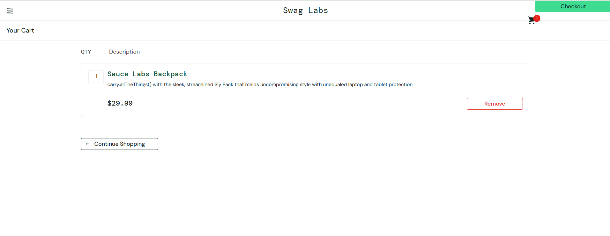

Product price on the Cart page:

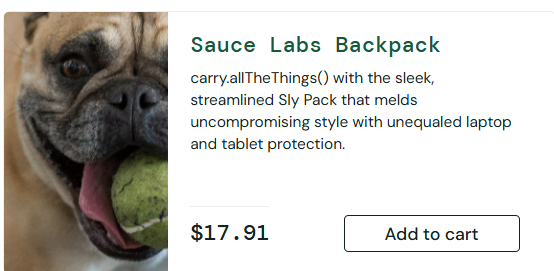

